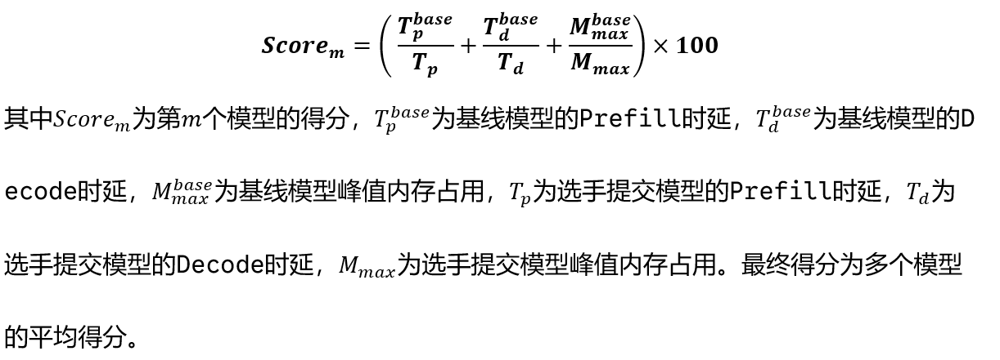
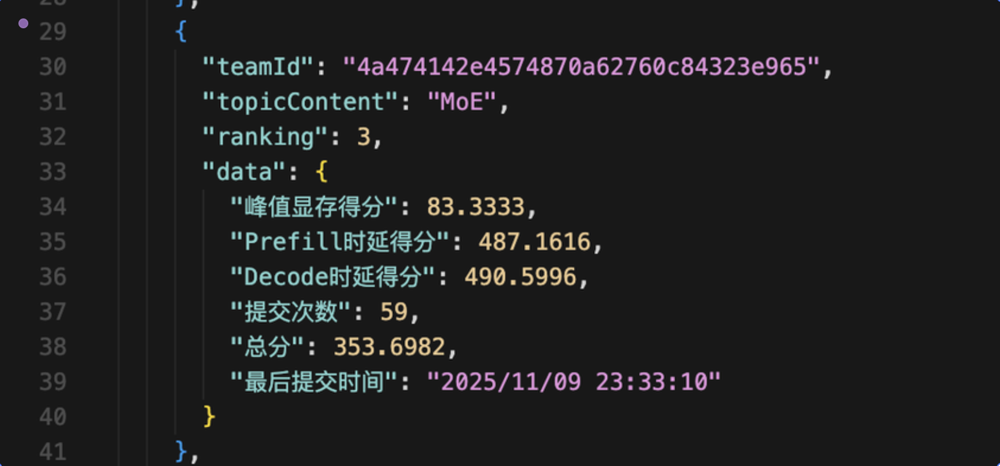
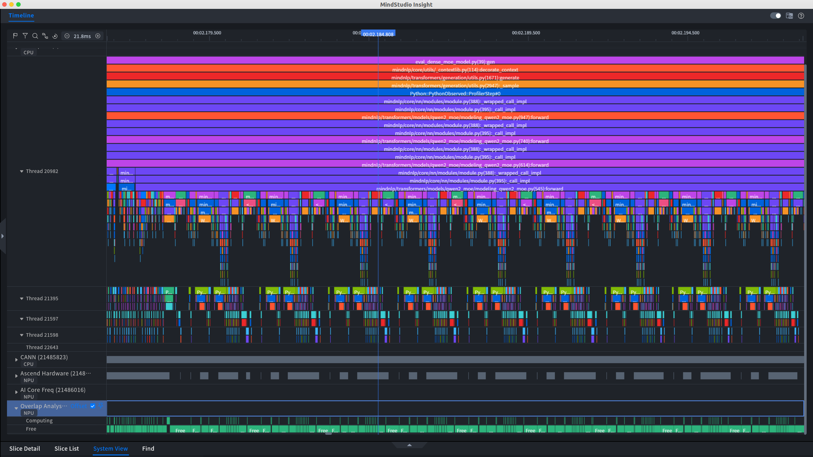

# README

## 比赛内容(MOE赛道)

MoE类：

deepseek-ai/deepseek-moe-16b-chat

Qwen/Qwen1.5-MoE-A2.7B-Chat

在无精度误差的情况下提速这两个模型的prefill，decode和显存峰值



## 最终成绩



# 比赛复盘

## 前期思路

- flash-attention ： 由于确实是很常用的加速手段，原理上也work，所以基本上贯穿了优化策略，但实际上收益甚微，就连显存上也没有显示出优化
- 算子融合 ： 一开始做的是诸如合并两次运算到一次运算里面；官方开会的时候提到了mindnlp.core.F，也提到了融合算子的下发调用开销可能和他的加速持平，实际测试下来没有加速，而且造成了精度误差(F.rms_norm)
- 合并python循环为矩阵运算 : 可以说是最有效的方法了，但是前期并没有探索的很深，浅浅掠过
- 复用图/kernal ： 这个可谓是花了最多心思、同时又没弄出效果的方法，具体放在中期测试里面讲
- 只遍历激活专家 ： 前期唯一的提分手段，从100->120

## 中期测试

- flash-attention
  - 通过简单网络来测试，flash-attention对于长序列确而有提速效果，但是在中短序列不明显，有时候还会因为未知波动效果不如baseline
  - 官方接口 `mindspore.ops.flash_attention_score`会带来一定的精度误差，具体而言qwen的prompt2会mismatch
- 算子融合
  - F.rms_norm 不仅没加速还带来了精度误差(应该是qwen的prompt1会mismatch)，遂直接放弃；对于review中提到的融合算子精度对齐没有缺陷，我猜测可能是进入F.rms_norm前所必须做的精度转化操作导致的，虽然我当时尝试了float32也还是有mismatch
  - 但是我没太理解会议里面讲的要比较下放损耗和融合算子加速效果，我个人仍然觉得这应该要work，但是却没有
- Graph&Pynative mode - kernal/图复用
  - 一开始打算用分桶填充策略，设置 `seq_len = [1,2,4,8,..,128]`的桶来多次调用模型生成来生成这些尺寸的图，为输入的prompt寻找恰好不小于他的桶进行padding触发图复用，但是毫无效果，于是开始探索图复用的条件，网上有说法是需要 `@mindspore.jit`即时编译/`Graph mode`静态图模式才能生成可以复用的图，于是进入下一步测试
  - @mindspore.jit：基本用不了，对于网络模型底层的try-except控制流，jit不支持这种低效分支，而我们又不大可能去修改底层的控制流(太多)，遂放弃
  - Graph mode：经过我用简单网络的多次测试(充分预热，多次测试取平均)，Graph模式比Pynative模式慢10倍左右，匪夷所思，初步怀疑是没触发图复用所以编译开销也算里面了(也就是单纯用Graph跑一次不会建立图？要显性调用什么函数或者装饰器吗)，遂半放弃
  - static-cache ：没做成功，因为需要把动态cache 换成 static cache，bug较多，时间上不允许，而且直播的时候说提升不大。
- Profiler
  - 这是一个很好的工具(疑似)，但是直到最后都不知道如何使用,一方面是断点设置和信息收集的问题，但这个问题不大
  - 
  - 最重要的是这个页面我只看到NPU的free/compute比值很大，除此之外不知道如何分析来调优了,要是能看**别人实际调优一遍肯定会好很多，求教程！！**
- MOE分析
  - 通过模型原来的代码，在self.mlp = ... 这一行，我发现了有一个if控制流，走moe/mlp,尝试使用走mlp之后，prefill/decode耗时降低了**20倍**，这时候我才意识到，原来前面有的没的都是**次要矛盾**，只要把**moe这个模块的代码**优化好了，就已经胜利了
  - 测试对比了moe和attention模块的占时，发现moe耗时是attention的20倍左右，所以压根不需要管attention部分的优化，也说明了为什么flash-attention部分没什么提速效果，因为**attention对总时长的影响实在微乎其微。**
  - 通过查看榜单，思考前两名prefill=1700的同时为什么显存都有略微下降，可以明确的是他们肯定用空间换了时间，但是具体是做了什么呢？
  - 通过对moe模块的分析，终于才把握住了主要矛盾；结合前面总总，不难推断肯定是moe部分把某些**串行换并行或者大矩阵计算**，从显存情况我更倾向于是**大矩阵计算**，所以问题就转移到如何做这个大矩阵运算

## 后期优化

以下代码是我们moe prefill 和 decode 最快的一版

### prefill

1. **Pad (填充)**: 将分配给不同专家的、数量不等的“锯齿状”token数据，通过 tensor_scatter_update 填充成一个规整的、[专家数, 最大Token数, 隐藏层大小] 的“矩形”张量。
2. **BMM (批量矩阵乘法)**: 利用这个规整的张量，调用一次 ops.bmm 即可同时计算所有专家的输出，将硬件并行度拉满。
3. **Gather (收集)**: 计算完成后，用 gather_nd 从填充后的结果中高效地提取出有效的输出数据。

```Python
    @no_grad()
    def moe_infer_prefill_fast(self, x, flat_expert_indices, flat_expert_weights):
        num_total_assignments = flat_expert_indices.shape[0]
        hidden_size = x.shape[-1]
        num_experts = len(self.experts)

        # 1) 排序专家分配
        idxs = flat_expert_indices.argsort()
        sorted_expert_indices = flat_expert_indices[idxs]
        sorted_token_indices = idxs // self.num_experts_per_tok
        permuted_tokens = x[sorted_token_indices]
        sorted_weights = flat_expert_weights[idxs]

        # 2) 计算Padding所需的尺寸
        tokens_per_expert = sorted_expert_indices.bincount(minlength=num_experts)
        max_tokens_per_expert = tokens_per_expert.max().item()
        
        if max_tokens_per_expert == 0:
            return ops.zeros_like(x)

        # 3) 创建Padded张量
        expert_offsets = ops.cumsum(tokens_per_expert, dim=0) - tokens_per_expert
        token_indices_in_sorted = mnp.arange(num_total_assignments)
        relative_pos_in_expert = token_indices_in_sorted - expert_offsets[sorted_expert_indices]
        
        gather_indices_sparse = ops.stack([sorted_expert_indices, relative_pos_in_expert], dim=1)

        # --- 关键修正: 使用 tensor_scatter_update ---
        padded_tokens = ops.zeros((num_experts, max_tokens_per_expert, hidden_size), dtype=x.dtype)
        # 直接使用 mindspore.ops.tensor_scatter_update
        padded_tokens = mindspore.ops.tensor_scatter_update(padded_tokens, gather_indices_sparse, permuted_tokens)
        
        # 4) 堆叠所有专家权重
        gate_weights = ops.stack([expert.gate_proj.weight for expert in self.experts], dim=0)
        up_weights   = ops.stack([expert.up_proj.weight for expert in self.experts], dim=0)
        down_weights = ops.stack([expert.down_proj.weight for expert in self.experts], dim=0)

        # 5) --- 核心：巨型批处理矩阵乘法 (BMM) ---
        gate_out = ops.bmm(padded_tokens, gate_weights.transpose(0, 2, 1))
        up_out   = ops.bmm(padded_tokens, up_weights.transpose(0, 2, 1))
        act_out = self.experts[0].act_fn(gate_out) * up_out
        padded_expert_outputs = ops.bmm(act_out, down_weights.transpose(0, 2, 1))
        
        # 6) 从Padded结果张量中按原始顺序gather回所有有效结果
        #    mindspore.ops.gather_nd 是 tensor_scatter_update 的逆操作，非常适合此场景
        expert_outputs_sorted = mindspore.ops.gather_nd(padded_expert_outputs, gather_indices_sparse)

        # 7) 最终加权和还原
        final_output = ops.zeros_like(x)
        final_output = mindspore.mint.scatter_add(
            final_output,
            0,
            sorted_token_indices.view(-1, 1).tile((1, hidden_size)),
            expert_outputs_sorted * sorted_weights
        )
        return final_output
```

### Decode

1. **向量化计算**

新代码先将这个 token 选出的 top_k 个专家的weight收集起来，用 ops.stack 堆叠成一个批次。然后，通过 **ops.bmm** 这个算子，一次性并行完成这topk个专家的所有计算。

1. **内存局部性优化**

通过 init_active_expert_cache 函数提前进行预处理。在模型预热（阶段识别出最常用的专家，然后将这些“热门专家”的权重从它们各自零散的位置提前抽调出来，用 ops.stack 堆叠成一个巨大且连续的内存块（即 self.cache_gate_w 等缓存张量）。在实际解码时，代码会优先从这个连续的缓存块中通过索引（self.cache_gate_w[eid]）直接读取权重。这种直接在大块连续内存上的索引操作速度极快，因为它能高效利用硬件的内存缓存机制（“缓存命中” Cache Hit），避免了复杂的对象查找。

```Python
    def init_active_expert_cache(self, active_ids):
        """
        预热后调用，将常用专家的权重预先提取并堆叠，
        形成一个内存连续的“快速访问缓存”。
        """
        self.cache_gate_w = ops.stack([self.experts[i].gate_proj.weight for i in active_ids], dim=0)
        self.cache_up_w   = ops.stack([self.experts[i].up_proj.weight for i in active_ids], dim=0)
        self.cache_down_w = ops.stack([self.experts[i].down_proj.weight for i in active_ids], dim=0)

    def moe_infer_decode_fast(self, x, flat_expert_indices, flat_expert_weights):
        """
        利用“权重缓存”和“BMM向量化”实现极致解码速度。
        """
        top_k = flat_expert_indices.shape[0]
        hidden_size = x.shape[-1]

        selected_gate_w = []
        selected_up_w = []
        selected_down_w = []

        # 1. 核心：从“快速缓存”或“慢速原始列表”中收集权重
        for eid in flat_expert_indices.tolist():
            # 检查缓存是否存在且eid在缓存范围内，如果满足则进入“快速通道”
            if hasattr(self, "cache_gate_w") and eid < self.cache_gate_w.shape[0]:
                selected_gate_w.append(self.cache_gate_w[eid])
                selected_up_w.append(self.cache_up_w[eid])
                selected_down_w.append(self.cache_down_w[eid])
            else: # 否则，回退到“慢速通道”
                selected_gate_w.append(self.experts[eid].gate_proj.weight)
                selected_up_w.append(self.experts[eid].up_proj.weight)
                selected_down_w.append(self.experts[eid].down_proj.weight)

        # 2. 将收集到的分散权重堆叠成一个批次
        selected_gate_w = ops.stack(selected_gate_w, dim=0)
        selected_up_w   = ops.stack(selected_up_w, dim=0)
        selected_down_w = ops.stack(selected_down_w, dim=0)

        # 3. 向量化计算：使用BMM一次性完成所有专家运算
        x_expanded = x.expand((top_k, 1, hidden_size))
        gate_out = ops.bmm(x_expanded, selected_gate_w.transpose(0, 2, 1))
        up_out   = ops.bmm(x_expanded, selected_up_w.transpose(0, 2, 1))
        intermediate_states = self.experts[0].act_fn(gate_out) * up_out
        expert_outputs = ops.bmm(intermediate_states, selected_down_w.transpose(0, 2, 1))
        
        # 4. 向量化聚合
        weighted_sum = (expert_outputs * flat_expert_weights.unsqueeze(-1)).sum(axis=0)
        return weighted_sum
```

#### 其他trick

- trick1 ： **劫持预热**，事先过一遍短中长三种prompt的generate，充分预热，当时的想法是瞎猫碰一下死耗子看看能不能触发图复用，结果意外确实降低了prefill时延，由于没有充分实验不确定原理
- trick2 ： 根据测试的三个prompt的长度，**用Prompt=0/1/2控制走的优化流**，部分优化流对某些Prompt会带来精度误差，这样是为了在实在解决不了精度问题的情况下,不至于直接放弃这个有效的优化，利用其他Prompt的优化先快带动后快
- trick3 ： **init_active_expert_cache和warmup_moe_model_deep**
  -  在预热的时候，记录下所有被激活过的专家的ID，缓存那些在预热中被激活过的active_ids的权重（ops.stack）。
  -  如果缓存已经建立，并且当前需要的专家 eid 就在缓存里，它会直接从连续的 cache_gate_w 张量中索引权重。


## 收益点

|                     策略名称                     | 说明                                                         |    显存峰值     |      Prefill      |      Decode       |       总分        |
| :----------------------------------------------: | :----------------------------------------------------------- | :-------------: | :---------------: | :---------------: | :---------------: |
|          DeepseekMoe + Qwen MoE模块优化          | Decode直接遍历激活专家                                       |     100→100     |      100→132      |      100→400      |      100→200      |
|                    Rotary优化                    | 用`ops.split`替代`rotate_half`切片方式                       |     100→100     | 133.4445→132.4821 | 427.7311→437.5848 | 220.919→223.3556  |
|        moe_prefill_fast / moe_decode_fast        | 串行专家计算改为大批量并行BMM，减少Python循环，速度更快（LongPrompt dispatch） |   100→98.4848   | 132.4821→163.8114 | 437.5848→454.7424 | 223.3556→239.0129 |
| init_active_expert_cache / warmup_moe_model_deep | 缓存预热期间激活专家权重，直接索引cache提升性能              | 98.4848→98.4848 | 163.8114→198.4985 | 454.7424→493.2538 | 239.0129→263.4124 |
|                Pad→BMM→Gather流程                | 将专家计算合并为一次BMM，保证精度float32并按LongPrompt dispatch | 98.4848→83.3333 | 198.4985→487.1616 | 493.2538→490.5996 | 263.4124→353.6982 |

## 总结

- 对于精度优化比赛，不应该一上来就花费大量时间在框架本身优化、常用优化等上，应该先通过充分测试找到**主要矛盾**，因为一般这种比赛都会有侧重点，比如这个比赛就是moe部分，如果第一天我就能测试出moe的时间占比如此浮夸，我想我就不会把时间放在细枝末节上面
- 对于调试工具(如Profiler等)，这是辅助完成第一步的，很有学习的必要，这种可视化工具分析的能力或者输出、断点分析能力将是打比赛的重要能力，说是最重要也不为过，这样才能有的放矢